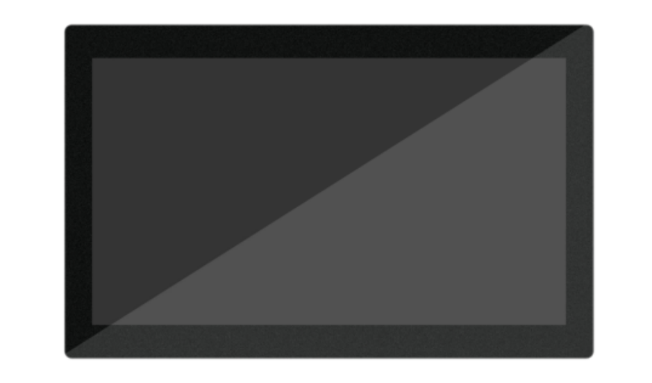
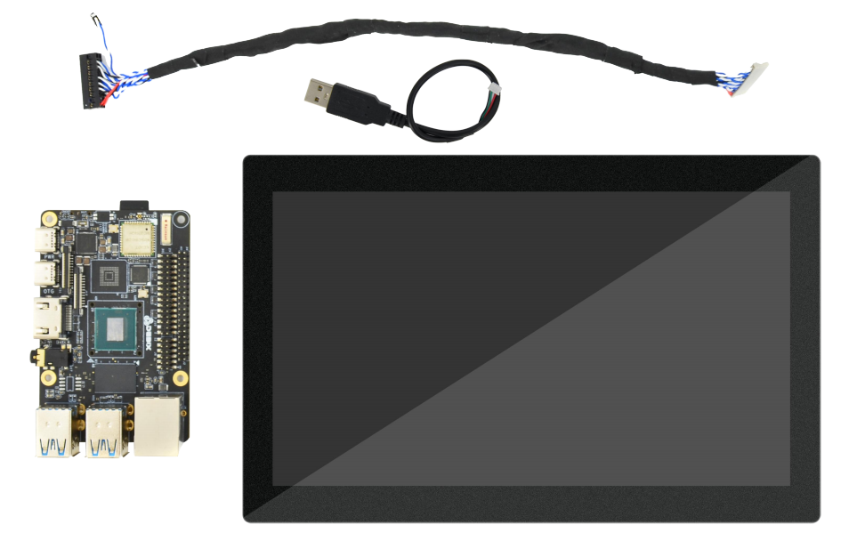

# DEBIX TD101A
 

## Overview
DEBIX TD101A LCD monitor comes with a 1280 x 800 display which has the size of 10.1". With LVDS display interface and USB touch interface, it is composed of a TFT-LCD panel, driver ICs and a backlight unit. The driver element is a-Si TFT active matrix.

## Main Features:
- 10.1" 1280*800 display size
- IPS with Normally Black display mode
- LVDS Interface
- RGB-stripe colour arrangement

## Compatibility:
Compatible with all DEBIX series

## Certificates:
RoHS

## Specification:
| DEBIX TD101A |  |
|:--------------|--|
| LCD Size     | 10.1 inch (Diagonal) |
| Driver Element | a-Si TFT action matrix |
| Resolution   | 1280 x 800 |
| Display Mode | IPS with Normally Black |
| Active Area  | 216.96mm x 135.60mm |
| Outline Dimension | 228.91mm x 148.57mm x 2.65mm |
| Colour Arrangement | RGB-stripe |
| LVDS Interface | 1 x LVDS with 20Pin header connector |
| Touch Interface | 1 x USB with 4Pin header connector |
| Luminance | 320 cd/m2 (Typ.) |
| Operating Temp. | -20℃~70℃ |
| Storage Temp. | -25°C to 75°C |
| Input Voltage | DC 5V |
| Net Weight  | 322g (±0.5g) |
| Gross Weight | 514g (±0.5g) |

 

## Contact Us
- **Headquarters**: DEBIX Technology Inc., 8345 Gold River Ct., Las Vegas, NV 89113, USA  
- **Factory**: 5-6/F., East Zone, Shunheda A2 Building, Liqxiandong Industrial Park, XiLi, Nanshan Dist., Shenzhen, China  
- **Email**: info@debix.io  
- **Website**: [www.debix.io](https://www.debix.io)  
- **Community**: [Discord](https://discord.com/invite/adaHHaDkH2)